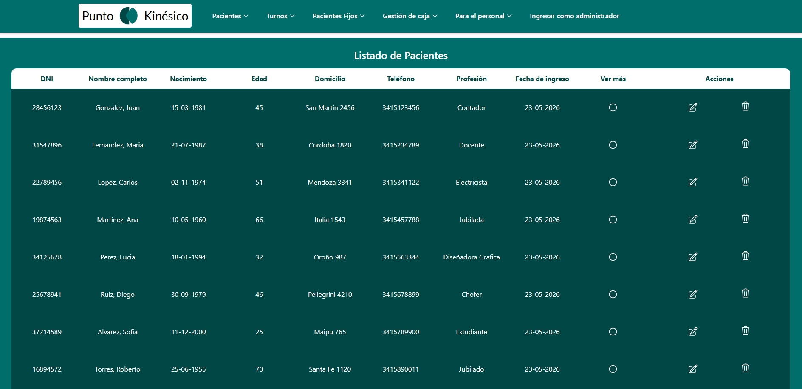
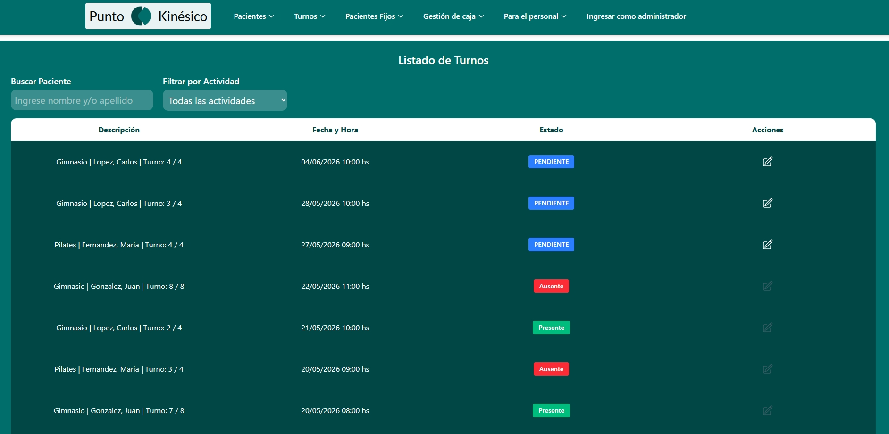
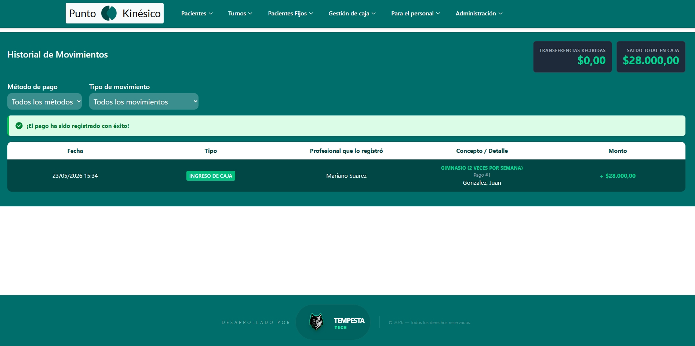
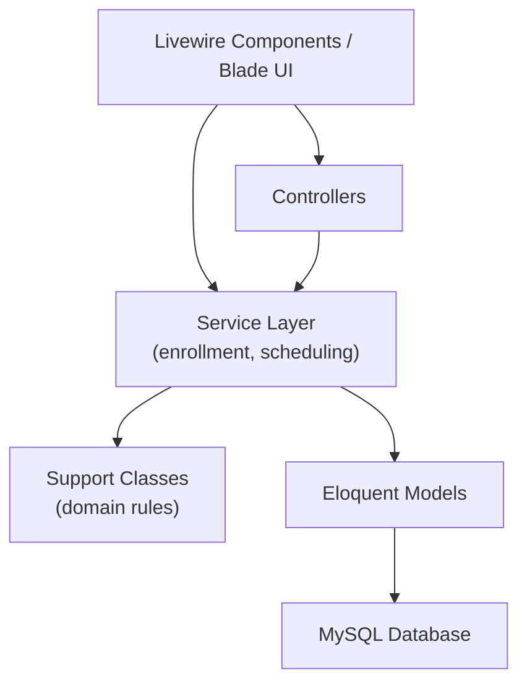

# Kinesiology Clinic ERP

> Fullstack ERP built for the daily operations of a real kinesiology clinic — replacing fragmented spreadsheet workflows with a single, centralized system.

Designed and implemented end-to-end using **PHP 8.2**, **Laravel 12**, **Livewire 4**, **MySQL**, **Docker**, and **Tailwind CSS**.

---

## TL;DR

- Centralizes patient management, scheduling, payments, attendance, and cash-flow operations in one application.
- Server-driven UI with Livewire — no SPA overhead for an admin-heavy, form-driven product.
- Critical enrollment and pricing workflows are covered by automated tests.
- Designed for non-technical clinic staff: operational complexity is handled in the backend, not in the UI.
- **Quick start:** `docker compose up --build` → [localhost:8000](http://localhost:8000) → access code `code123`

---

## The Problem

The clinic previously relied on multiple Excel spreadsheets and manual administrative processes, which led to:

- Scheduling conflicts
- Duplicated patient data
- Human errors in billing and enrollment
- Lost operational information
- Inefficient patient tracking

This ERP consolidates those workflows into a single system used for real daily operations.

---

## Screenshots

### Patient Administration


### Appointment Management


### Financial Operations


---

## Tech Stack

| Layer | Technologies |
|---|---|
| Backend | PHP 8.2, Laravel 12, Eloquent ORM |
| Frontend | Livewire 4, Blade, Alpine.js, Tailwind CSS |
| Database | MySQL 8 |
| Infrastructure | Docker, Docker Compose, Git |
| Testing | PHPUnit 11 |

---

## Core Modules

| Module | What it covers |
|---|---|
| **Patients** | CRUD, emergency contacts, health insurance affiliations, pathology and symptom tracking |
| **Patient types** | Regular patients, walk-in (*casual*) patients, and fixed-schedule (*fijo*) subscriptions |
| **Activities & enrollment** | Kinesiology (with/without medical order) and general activities, combo pricing, session packages |
| **Appointments** | Manual and auto-generated schedules, calendar views, rescheduling, attendance notes |
| **Payments** | Session payments, copayments, debt tracking |
| **Cash flow** | Income/expense movements, professional worked-hours registration |
| **Administration** | Professionals, pricing, health insurance providers, activity combos |

---

## Key Technical Decisions

### Why Livewire instead of a SPA?

The application is primarily administrative and form-driven. A SPA would have added frontend complexity, deployment overhead, and slower iteration without meaningful UX gains for this use case.

Livewire was chosen because it enables:

- Faster iteration on operational workflows
- Reduced frontend complexity
- Simpler deployment
- Server-driven state and validation

### Transaction safety in financial workflows

Enrollment, payments, and cash operations use database transactions with rollback protection to prevent inconsistent state — for example, an activity registration is not persisted if appointment creation fails.

### Recurring appointment generation

A scheduled Artisan command generates monthly appointments for fixed-schedule patients, with conflict validation, professional availability checks, and state-aware rescheduling logic when slots are unavailable.

---

## Architecture

The application follows a server-driven fullstack architecture. Business-critical workflows are orchestrated through a combination of Livewire components, controllers, and dedicated service classes.



**Principles applied:**

- Separation of concerns between UI, orchestration, and persistence
- Service-layer encapsulation for the most critical enrollment workflows
- Domain rules extracted into support classes where they are reused or tested in isolation
- Validation-driven consistency across scheduling, attendance, and payments

> **Note:** Not every workflow goes through a service class. Simpler CRUD flows are handled directly in Livewire components with transactional boundaries where needed. The service layer is reserved for the most complex, multi-step business operations.

---

## Domain Model

The relational schema (~27 Eloquent models) reflects real clinic operations:

- Patients, professionals, and health insurance affiliations
- Activities, combos, and time-based pricing
- Patient enrollments and medical orders
- Appointments, attendance, and session notes
- Payments, copayments, and cash movements

Special attention was given to consistency across interconnected entities — for example, linking enrollment pricing to combo rules, insurance validity, and appointment generation.

---

## Access Control

The system uses **session-based area isolation**, not a full role/permission framework:

| Area | Mechanism |
|---|---|
| **Operational access** | Shared access code verified against `CODIGO_ACCESO_SISTEMA`; stored in session as `autorizado` |
| **Administration** | Separate admin code (`CODIGO_ADMINISTRADOR`); unlocks pricing, professionals, and insurance management routes |
| **Route protection** | Custom middleware (`verificar.acceso`, `verificar.acceso.admin`) on protected route groups |

This approach fits an internal clinic tool with a small, trusted staff. It is intentionally simple — not Laravel Auth with user accounts and policies.

---

## Testing

Automated tests focus on protecting critical business workflows rather than chasing coverage percentages.

```bash
composer test
# or
php artisan test
```

**What is covered (25 tests, 47 assertions):**

| Area | Tests |
|---|---|
| **Enrollment service** | Combo pricing (x5, x10), individual session pricing, monthly pricing, insurance validation, duplicate registration protection, transaction rollback on failure, auto-generated appointments |
| **Domain rules** | Registration modality detection (with/without medical order), pricing strategy selection, SQL duplicate-entry detection across MySQL and SQLite |

Tests run against an in-memory SQLite database (configured in `phpunit.xml`).

---

## Running the Project

### Prerequisites

**Docker (recommended for reviewers):**

- [Docker Desktop](https://www.docker.com/products/docker-desktop/) (or Docker Engine + Compose v2)

**Local development:**

- PHP 8.2+, Composer, Node.js
- MySQL 8

### Local setup

```bash
# Install dependencies
composer install
npm install

# Environment — create a .env file with at least:
php artisan key:generate

# Configure at minimum:
# DB_CONNECTION=mysql
# DB_HOST=127.0.0.1
# DB_PORT=3306
# DB_DATABASE=erp
# DB_USERNAME=...
# DB_PASSWORD=...
# CODIGO_ACCESO_SISTEMA=your-access-code
# CODIGO_ADMINISTRADOR=your-admin-code

# Database
php artisan migrate:fresh --seed

# Run application
php artisan serve
```

In a separate terminal:

```bash
npm run dev
```

Open [http://127.0.0.1:8000](http://127.0.0.1:8000) and enter the operational access code.

For local development with all services (server, queue, logs, Vite):

```bash
composer dev
```

### Docker setup

The fastest way to run and review the project. No local PHP, Composer, Node, or `.env` file is required — environment variables are defined in `docker-compose.yml`, and the container entrypoint handles database setup automatically.

**Requirements:** Docker Desktop (or Docker Engine + Compose v2).

```bash
docker compose up --build
```

On first start, the app container will:

1. Wait until MySQL is ready
2. Run migrations and seeders
3. Cache configuration, routes, and views
4. Start the application on port `8000`

The first build may take a few minutes (Vite asset compilation + Composer dependencies). Subsequent starts are faster.

**Application URL:** [http://localhost:8000](http://localhost:8000)

**Demo access codes** (preconfigured in `docker-compose.yml`):

| Purpose | Code |
|---|---|
| Operational access (main app) | `code123` |
| Administration area | `admin` |

After opening the URL, enter the operational access code. Use the admin code when prompted for administration routes (pricing, professionals, health insurance providers).

**What runs:**

| Service | Container | Host port |
|---|---|---|
| Laravel app (PHP 8.2 + pre-built Vite assets) | `erp_app` | `8000` |
| MySQL 8 | `erp_db` | `3307` |

MySQL credentials (demo only): user `root`, password `root`, database `erp`.

**Reset demo data** (clean database and start fresh):

```bash
docker compose down -v
docker compose up --build
```

**Stop the stack:**

```bash
docker compose down
```

**Optional — view app logs:**

```bash
docker compose logs -f app
```

> **Note:** Docker runs the application in demo mode with precompiled frontend assets. For active frontend development with hot reload, use the [local setup](#local-setup) above and run `npm run dev` in a separate terminal.

---

## Complex Problems Solved

### Recurring appointment generation

Fixed-schedule patients require monthly appointment batches. The system:

1. Reads each patient's weekly schedule slots
2. Validates availability against existing appointments
3. Attempts replacement slots when conflicts arise
4. Persists results inside a transaction

Implemented via `app:generar-turnos-mensuales` (Artisan command) and `TurnoService`.

### Enrollment pricing with multiple modalities

Kinesiology enrollments behave differently depending on context:

- **With medical order** — combo pricing tied to covered sessions; payment marked complete on registration
- **Without order** — combo or per-session pricing based on quantity
- **General activities** — monthly subscription pricing via activity combos

All of this is orchestrated in `ActividadPacienteService` with explicit validation and transactional persistence.

### Duplicate registration protection

Same-day duplicate enrollments are blocked at both the application layer (pre-check) and the database layer (unique constraint), with error detection that works across MySQL and SQLite.

---

## Product & Usability

A major challenge was balancing operational complexity with usability for non-technical clinic staff. This influenced:

- Workflow design (separate flows for kinesiology with/without medical order)
- Form organization and progressive disclosure
- Navigation structure aligned with daily reception tasks
- Dashboard layout for attendance and payment status at a glance

---

## Lessons Learned

Building a system for real daily operations reinforced the importance of:

- **Transactional consistency** — especially when enrollment, appointments, and payments are created in a single operation
- **Defensive validation** — business rules enforced at multiple layers, not only in the UI
- **Honest abstractions** — service classes where complexity warrants them, not everywhere by default
- **UX simplicity over architectural purity** — clinic staff need clarity, not cleverness

---

## Project Structure (high level)

```
app/
├── Console/Commands/     # Scheduled jobs (e.g. monthly appointment generation)
├── Http/
│   ├── Controllers/      # Request handling for non-Livewire flows
│   └── Middleware/       # Session-based access control
├── Models/               # ~27 Eloquent models
├── Services/             # Critical workflow orchestration
└── Support/              # Reusable domain rules

resources/views/components/   # Livewire Volt components (⚡)
tests/
├── Feature/              # Service-layer integration tests
└── Unit/                 # Domain rule unit tests
```

---

## License

Private project — all rights reserved.
